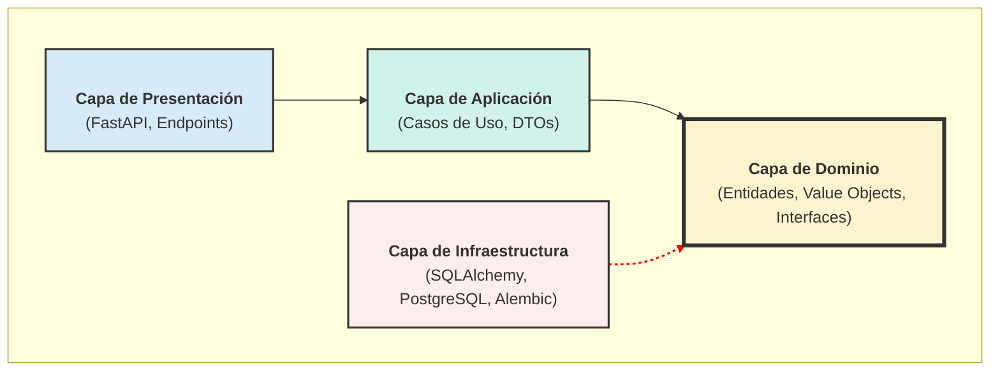

# ⛳ Ryder Cup Manager API


API REST para la gestión de torneos de golf amateur al estilo Ryder Cup, construida siguiendo los principios de **Clean Architecture** y **Domain-Driven Design (DDD)**.

---

## 🚀 Visión del Proyecto

El objetivo es crear una plataforma robusta y escalable que permita a grupos de amigos organizar sus propios torneos de golf Ryder Cup, gestionando equipos, jugadores, partidos en diferentes formatos (Foursome, Fourball, Individual) y un sistema de puntuación en tiempo real.

---

## 🏗️ Arquitectura: Clean Architecture

El proyecto está estructurado como un **Monolito Modular** siguiendo los principios de la Clean Architecture para garantizar la separación de responsabilidades, la testeabilidad y la mantenibilidad a largo plazo.


*   **Regla de Dependencia**: Las flechas apuntan hacia adentro. Las capas exteriores conocen a las interiores, pero las interiores no saben nada de las exteriores.
*   **Inversión de Dependencia**: La capa de Infraestructura implementa las interfaces (contratos) definidas en la capa de Dominio.

---

## ✨ Características Principales Implementadas

-   **📦 Entorno Dockerizado**: `docker-compose` para levantar la aplicación y la base de datos PostgreSQL con un solo comando.
-   **🗃️ Persistencia con SQLAlchemy**: Mapeo de entidades de dominio a tablas de base de datos usando el patrón Data Mapper.
-   **📜 Migraciones con Alembic**: Gestión versionada y automatizada del esquema de la base de datos.
-   **🏛️ Patrones de Diseño**:
    -   Repository y Unit of Work para abstraer la persistencia.
    -   Value Objects para una lógica de negocio robusta y sin tipos primitivos.
    -   Inyección de Dependencias para un bajo acoplamiento.
-   **⚡ Arquitectura Orientada a Eventos**: Sistema de **Eventos de Dominio** para comunicar módulos de forma desacoplada.
-   **📝 Logging Estructurado**: Sistema de logging avanzado con trazabilidad (`correlation_id`) y múltiples formatos (JSON, texto).
-   **🧪 Testing Exhaustivo**: Suite de más de 200 tests con `pytest`, cubriendo unitarios y de integración.

---

## 🛠️ Cómo Empezar (Entorno de Desarrollo)

### Prerrequisitos
-   Docker y Docker Compose
-   Python 3.11+
-   Un entorno virtual (ej: `venv`)

### Pasos

1.  **Clonar el repositorio:**
    ```bash
    git clone <url-del-repositorio>
    cd RyderCupAm
    ```

2.  **Crear el fichero de entorno:**
    Copia el fichero `.env.example` (si existiera) o crea un fichero `.env` y define las variables de entorno necesarias (credenciales de la base de datos).

3.  **Levantar los contenedores:**
    Este comando construirá la imagen de la aplicación, descargará la de PostgreSQL y pondrá todo en marcha.
    ```bash
    docker-compose up --build
    ```
    La API estará disponible en `http://localhost:8000`.

4.  **Aplicar las migraciones de la base de datos:**
    En otra terminal, con el entorno virtual activado, ejecuta:
    ```bash
    alembic upgrade head
    ```

---

## 📂 Estructura del Proyecto

```
.
├── alembic/            # Migraciones de la base de datos
├── docs/               # Documentación (ADRs, etc.)
├── src/
│   ├── modules/        # Módulos de negocio (ej: user, tournament)
│   │   └── user/
│   │       ├── application/
│   │       ├── domain/
│   │       └── infrastructure/
│   └── shared/         # Código compartido (EventBus, Logger, etc.)
├── tests/              # Tests unitarios y de integración
├── .env                # Fichero de variables de entorno (ignorado por Git)
├── docker-compose.yml  # Orquestación de contenedores
├── Dockerfile          # Definición de la imagen de la aplicación
└── README.md           # ¡Estás aquí!
```

---

## 🗺️ Roadmap y Próximos Pasos

El siguiente gran hito es la implementación de la **Capa de Aplicación**, desarrollando los casos de uso que orquestarán la lógica de dominio y la persistencia que ya hemos construido.

1.  **Capa de Aplicación**: Implementar `RegisterUserUseCase`.
2.  **Capa de Presentación**: Crear el endpoint en FastAPI para el registro.
3.  **Módulo de Torneos**: Empezar el modelado del dominio de los torneos.