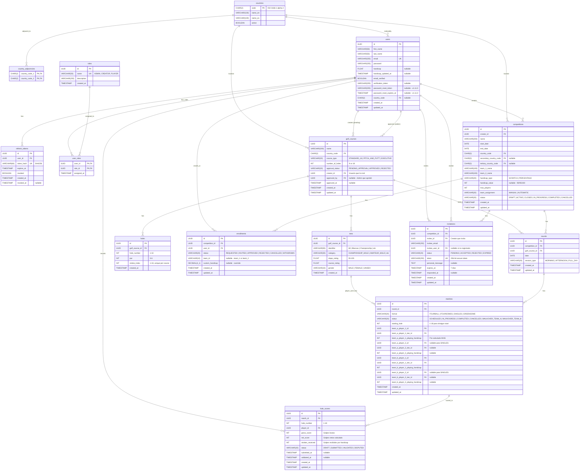

# 🗄️ Database Entity Relationship Diagram (ERD)

> **Versión:** v2.1.0 (Planificación)
> **Última actualización:** 7 de Enero de 2026
> **Base de datos:** PostgreSQL 15+

---

## 📊 Diagrama Completo



---

## 📋 Tablas Actuales (v1.12.1)

| Tabla | Registros Típicos | Módulo | Versión |
|-------|-------------------|--------|---------|
| `countries` | 166 | Shared | v1.0.0 |
| `country_adjacencies` | 614 | Shared | v1.0.0 |
| `users` | 100-10,000+ | User | v1.0.0 |
| `refresh_tokens` | 100-50,000 | User | v1.8.0 |
| `competitions` | 10-1,000 | Competition | v1.3.0 |
| `enrollments` | 200-50,000 | Competition | v1.3.0 |

**Total tablas actuales:** 6

---

## 🆕 Tablas Nuevas (v2.1.0)

| Tabla | Registros Típicos | Módulo | Sprint |
|-------|-------------------|--------|--------|
| `roles` | 3-10 | User | Sprint 1 |
| `user_roles` | 100-10,000+ | User | Sprint 1 |
| `golf_courses` | 100-5,000 | Golf Courses | Sprint 1 |
| `tees` | 300-25,000 (3-5 por campo) | Golf Courses | Sprint 1 |
| `holes` | 1,800-90,000 (18 por campo) | Golf Courses | Sprint 1 |
| `rounds` | 30-3,000 (3-10 por torneo) | Competition | Sprint 3 |
| `matches` | 100-30,000 (10-30 por round) | Competition | Sprint 3 |
| `invitations` | 500-100,000 | Competition | Sprint 3 |
| `hole_scores` | 5,000-5,000,000 (72 por match singles, 144 fourball) | Scoring | Sprint 4 |

**Total tablas nuevas:** 9

**Total tablas v2.1.0:** 15 tablas

---

## 🔑 Índices Principales

### Índices Actuales
```sql
-- users
CREATE INDEX idx_users_email ON users(email);
CREATE INDEX idx_users_country ON users(country_code);

-- refresh_tokens
CREATE INDEX idx_refresh_tokens_user_id ON refresh_tokens(user_id);
CREATE INDEX idx_refresh_tokens_token_hash ON refresh_tokens(token_hash);
CREATE INDEX idx_refresh_tokens_expires_at ON refresh_tokens(expires_at);

-- competitions
CREATE INDEX idx_competitions_creator ON competitions(creator_id);
CREATE INDEX idx_competitions_status ON competitions(status);
CREATE INDEX idx_competitions_dates ON competitions(start_date, end_date);

-- enrollments
CREATE INDEX idx_enrollments_competition ON enrollments(competition_id);
CREATE INDEX idx_enrollments_user ON enrollments(user_id);
CREATE INDEX idx_enrollments_status ON enrollments(status);
```

### Índices Nuevos (v2.1.0)
```sql
-- roles & user_roles
CREATE INDEX idx_user_roles_user ON user_roles(user_id);
CREATE INDEX idx_user_roles_role ON user_roles(role_id);

-- golf_courses
CREATE INDEX idx_golf_courses_country ON golf_courses(country_code);
CREATE INDEX idx_golf_courses_status ON golf_courses(approval_status);
CREATE INDEX idx_golf_courses_creator ON golf_courses(creator_id);

-- tees
CREATE INDEX idx_tees_course ON tees(golf_course_id);
CREATE INDEX idx_tees_category ON tees(category);

-- holes
CREATE INDEX idx_holes_course ON holes(golf_course_id);
CREATE UNIQUE INDEX idx_holes_course_number ON holes(golf_course_id, hole_number);

-- rounds
CREATE INDEX idx_rounds_competition ON rounds(competition_id);
CREATE INDEX idx_rounds_course ON rounds(golf_course_id);
CREATE INDEX idx_rounds_date ON rounds(date);

-- matches
CREATE INDEX idx_matches_round ON matches(round_id);
CREATE INDEX idx_matches_status ON matches(status);
CREATE INDEX idx_matches_players ON matches(team_a_player_1_id, team_a_player_2_id, team_b_player_1_id, team_b_player_2_id);

-- invitations
CREATE INDEX idx_invitations_competition ON invitations(competition_id);
CREATE INDEX idx_invitations_email ON invitations(invitee_email);
CREATE INDEX idx_invitations_user ON invitations(invitee_user_id);
CREATE INDEX idx_invitations_status ON invitations(status);
CREATE INDEX idx_invitations_token ON invitations(token);

-- hole_scores
CREATE INDEX idx_hole_scores_match ON hole_scores(match_id);
CREATE INDEX idx_hole_scores_player ON hole_scores(player_id);
CREATE INDEX idx_hole_scores_status ON hole_scores(status);
CREATE UNIQUE INDEX idx_hole_scores_match_hole_player ON hole_scores(match_id, hole_number, player_id);
```

---

## 📐 Estimación de Crecimiento

### Escenario: 1 Competición Típica (20 jugadores, 3 días)

| Tabla | Registros | Cálculo |
|-------|-----------|---------|
| `golf_courses` | +1 | 1 campo |
| `tees` | +4 | 4 tees (60, 56, 52, 47) |
| `holes` | +18 | 18 hoyos |
| `rounds` | +6 | 2 rounds/día x 3 días |
| `matches` | +60 | 10 matches/round x 6 rounds |
| `invitations` | +20 | 20 jugadores invitados |
| `hole_scores` | +2,160 | 60 matches x 18 hoyos x 2 jugadores (singles) |

**Total por competición:** ~2,269 registros

### Escenario: 100 Competiciones Activas

| Tabla | Registros |
|-------|-----------|
| `golf_courses` | 100 |
| `tees` | 400 |
| `holes` | 1,800 |
| `rounds` | 600 |
| `matches` | 6,000 |
| `invitations` | 2,000 |
| `hole_scores` | 216,000 |

**Total estimado:** ~227,000 registros nuevos

---

## 🚀 Estrategia de Optimización

### Particionamiento (Futuro v2.2.0)
```sql
-- Particionar hole_scores por fecha (mensual)
CREATE TABLE hole_scores_2026_01 PARTITION OF hole_scores
    FOR VALUES FROM ('2026-01-01') TO ('2026-02-01');
```

### Archivado (Futuro v2.2.0)
- Mover `hole_scores` de competiciones completadas a tabla de archivo
- Retención: 2 años en BD activa, 5 años en archivo

### Read Replicas (Futuro v2.2.0)
- Leaderboards consultan read replica
- Escrituras (scoring) en BD principal

---

## 🔗 Referencias

- **ROADMAP.md**: Planificación v2.1.0
- **ADR-025**: Competition Module Evolution
- **Migraciones**: `alembic/versions/`
