# 📧 Email Verification - Frontend Integration Guide

## Overview

Esta guía explica cómo integrar la verificación de email en el frontend de RyderCupWeb.

## Flujo de Usuario

```mermaid
sequenceDiagram
    participant U as Usuario
    participant F as Frontend
    participant B as Backend API
    participant M as Mailgun

    U->>F: 1. Registrarse
    F->>B: POST /api/v1/auth/register
    B->>B: Generar token
    B->>M: Enviar email
    B->>F: {user, email_verified: false}
    F->>U: "Revisa tu email"

    U->>U: Abre email
    U->>F: Click en link de verificación
    F->>B: POST /api/v1/auth/verify-email
    B->>F: {message, email_verified: true}
    F->>U: "Email verificado!"
```



## 1. Endpoints API

### Registro de Usuario
```http
POST /api/v1/auth/register
Content-Type: application/json

{
  "email": "user@example.com",
  "password": "securepassword123",
  "first_name": "John",
  "last_name": "Doe",
  "manual_handicap": null
}
```

**Respuesta:**
```json
{
  "id": "123e4567-e89b-12d3-a456-426614174000",
  "email": "user@example.com",
  "first_name": "John",
  "last_name": "Doe",
  "email_verified": false,
  "handicap": null,
  "created_at": "2025-11-12T18:00:00Z",
  "updated_at": "2025-11-12T18:00:00Z"
}
```

**Nota**: `email_verified` será `false` al registrarse. El usuario recibirá un email automáticamente.

### Verificación de Email
```http
POST /api/v1/auth/verify-email
Content-Type: application/json

{
  "token": "el-token-del-email"
}
```

**Respuesta Exitosa (200):**
```json
{
  "message": "Email verificado exitosamente",
  "email_verified": true
}
```

**Respuesta Error (400):**
```json
{
  "detail": "Token de verificación inválido o expirado"
}
```

## 2. Cambios en el Flujo de Registro

### Antes
```javascript
// Registro directo
register(data) -> login(email, password) -> redirect("/dashboard")
```

### Ahora
```javascript
// Registro con verificación
register(data) -> mostrar mensaje de verificación -> esperar verificación
```

## 3. Componentes Frontend Necesarios

### A. Página de Registro (actualizar)

Después del registro exitoso, mostrar mensaje:

```jsx
// RegisterPage.jsx
const [registrationSuccess, setRegistrationSuccess] = useState(false);
const [userEmail, setUserEmail] = useState('');

const handleRegister = async (formData) => {
  try {
    const response = await api.post('/api/v1/auth/register', formData);
    setUserEmail(response.data.email);
    setRegistrationSuccess(true);
    // NO hacer login automático
  } catch (error) {
    // Manejar errores
  }
};

return (
  <>
    {registrationSuccess ? (
      <VerificationEmailSent email={userEmail} />
    ) : (
      <RegisterForm onSubmit={handleRegister} />
    )}
  </>
);
```

### B. Componente: Email de Verificación Enviado

```jsx
// VerificationEmailSent.jsx
export const VerificationEmailSent = ({ email }) => {
  return (
    <div className="verification-sent">
      <h2>¡Registro Exitoso!</h2>
      <p>
        Hemos enviado un correo de verificación a <strong>{email}</strong>
      </p>
      <p>
        Por favor, revisa tu bandeja de entrada (y spam) y haz clic en el enlace
        para verificar tu cuenta.
      </p>
      <div className="actions">
        <button onClick={() => window.location.href = '/login'}>
          Ir al Login
        </button>
      </div>
    </div>
  );
};
```

### C. Página: Verificar Email

Esta es la página a la que llega el usuario cuando hace clic en el email.

**Ruta**: `/verify-email?token=ABC123`

```jsx
// VerifyEmailPage.jsx
import { useEffect, useState } from 'react';
import { useSearchParams, useNavigate } from 'react-router-dom';
import { api } from '../services/api';

export const VerifyEmailPage = () => {
  const [searchParams] = useSearchParams();
  const navigate = useNavigate();
  const [status, setStatus] = useState('verifying'); // verifying | success | error
  const [message, setMessage] = useState('');

  useEffect(() => {
    const token = searchParams.get('token');

    if (!token) {
      setStatus('error');
      setMessage('Token de verificación no encontrado');
      return;
    }

    verifyEmail(token);
  }, [searchParams]);

  const verifyEmail = async (token) => {
    try {
      const response = await api.post('/api/v1/auth/verify-email', { token });
      setStatus('success');
      setMessage(response.data.message);

      // Redirigir al login después de 3 segundos
      setTimeout(() => {
        navigate('/login?verified=true');
      }, 3000);
    } catch (error) {
      setStatus('error');
      setMessage(error.response?.data?.detail || 'Error al verificar el email');
    }
  };

  return (
    <div className="verify-email-page">
      {status === 'verifying' && (
        <div className="verifying">
          <div className="spinner" />
          <h2>Verificando tu email...</h2>
          <p>Por favor espera un momento</p>
        </div>
      )}

      {status === 'success' && (
        <div className="success">
          <div className="success-icon">✓</div>
          <h2>¡Email Verificado!</h2>
          <p>{message}</p>
          <p>Redirigiendo al login...</p>
        </div>
      )}

      {status === 'error' && (
        <div className="error">
          <div className="error-icon">✕</div>
          <h2>Error en la Verificación</h2>
          <p>{message}</p>
          <button onClick={() => navigate('/login')}>
            Ir al Login
          </button>
        </div>
      )}
    </div>
  );
};
```

### D. Indicador de Email Verificado en Perfil

```jsx
// UserProfile.jsx
export const UserProfile = ({ user }) => {
  return (
    <div className="user-profile">
      <div className="email-section">
        <label>Email:</label>
        <span>{user.email}</span>
        {user.email_verified ? (
          <span className="verified-badge">
            ✓ Verificado
          </span>
        ) : (
          <span className="unverified-badge">
            ⚠ No verificado
          </span>
        )}
      </div>
    </div>
  );
};
```

## 4. Servicio API (JavaScript)

```javascript
// services/api.js
import axios from 'axios';

const API_BASE_URL = process.env.REACT_APP_API_URL || 'http://localhost:8000';

export const api = axios.create({
  baseURL: API_BASE_URL,
  headers: {
    'Content-Type': 'application/json',
  },
});

// Interceptor para agregar token JWT
api.interceptors.request.use((config) => {
  const token = localStorage.getItem('access_token');
  if (token) {
    config.headers.Authorization = `Bearer ${token}`;
  }
  return config;
});

// Auth API
export const authApi = {
  register: (data) => api.post('/api/v1/auth/register', data),
  login: (data) => api.post('/api/v1/auth/login', data),
  verifyEmail: (token) => api.post('/api/v1/auth/verify-email', { token }),
  getCurrentUser: () => api.get('/api/v1/auth/current-user'),
};
```

## 5. Rutas de React Router

```jsx
// App.jsx o router.jsx
import { BrowserRouter, Routes, Route } from 'react-router-dom';
import { RegisterPage } from './pages/RegisterPage';
import { VerifyEmailPage } from './pages/VerifyEmailPage';
import { LoginPage } from './pages/LoginPage';

function App() {
  return (
    <BrowserRouter>
      <Routes>
        <Route path="/register" element={<RegisterPage />} />
        <Route path="/verify-email" element={<VerifyEmailPage />} />
        <Route path="/login" element={<LoginPage />} />
        {/* ... otras rutas */}
      </Routes>
    </BrowserRouter>
  );
}
```

## 6. Estilos CSS (Ejemplo)

```css
/* VerifyEmailPage.css */
.verify-email-page {
  max-width: 500px;
  margin: 50px auto;
  padding: 30px;
  text-align: center;
  background: white;
  border-radius: 8px;
  box-shadow: 0 2px 10px rgba(0, 0, 0, 0.1);
}

.verifying .spinner {
  width: 50px;
  height: 50px;
  border: 4px solid #f3f3f3;
  border-top: 4px solid #4CAF50;
  border-radius: 50%;
  animation: spin 1s linear infinite;
  margin: 0 auto 20px;
}

@keyframes spin {
  0% { transform: rotate(0deg); }
  100% { transform: rotate(360deg); }
}

.success .success-icon {
  width: 80px;
  height: 80px;
  background: #4CAF50;
  color: white;
  font-size: 48px;
  line-height: 80px;
  border-radius: 50%;
  margin: 0 auto 20px;
}

.error .error-icon {
  width: 80px;
  height: 80px;
  background: #f44336;
  color: white;
  font-size: 48px;
  line-height: 80px;
  border-radius: 50%;
  margin: 0 auto 20px;
}

.verified-badge {
  color: #4CAF50;
  font-weight: bold;
  margin-left: 10px;
}

.unverified-badge {
  color: #ff9800;
  font-weight: bold;
  margin-left: 10px;
}
```

## 7. Variables de Entorno

```env
# .env
REACT_APP_API_URL=http://localhost:8000
# En producción:
# REACT_APP_API_URL=https://api.rydercupfriends.com
```

## 8. Testing (Jest + React Testing Library)

```jsx
// VerifyEmailPage.test.jsx
import { render, screen, waitFor } from '@testing-library/react';
import { BrowserRouter } from 'react-router-dom';
import { VerifyEmailPage } from './VerifyEmailPage';
import { api } from '../services/api';

jest.mock('../services/api');

test('verifica email exitosamente', async () => {
  api.post.mockResolvedValue({
    data: { message: 'Email verificado exitosamente', email_verified: true }
  });

  render(
    <BrowserRouter>
      <VerifyEmailPage />
    </BrowserRouter>
  );

  await waitFor(() => {
    expect(screen.getByText('¡Email Verificado!')).toBeInTheDocument();
  });
});
```

## 9. Checklist de Implementación

- [ ] Actualizar página de registro para mostrar mensaje de verificación
- [ ] Crear componente `VerificationEmailSent`
- [ ] Crear página `VerifyEmailPage` con ruta `/verify-email`
- [ ] Agregar indicador de email verificado en perfil de usuario
- [ ] Actualizar servicio API con endpoint de verificación
- [ ] Agregar estilos para los nuevos componentes
- [ ] Configurar variables de entorno
- [ ] Agregar tests para la verificación
- [ ] Probar flujo completo end-to-end

## 10. Consideraciones de UX

### Email No Verificado
- **NO bloquear** el acceso inmediatamente
- Mostrar un banner informativo: "Por favor verifica tu email"
- Opción para reenviar email de verificación (futuro)

### Email Verificado
- Mostrar badge de verificación
- Quitar banners de advertencia
- Habilitar funcionalidades completas

## 11. Próximas Mejoras (Opcionales)

1. **Reenviar Email de Verificación**
   ```jsx
   POST /api/v1/auth/resend-verification
   { "email": "user@example.com" }
   ```

2. **Expiración de Tokens**
   - Tokens válidos por 24 horas
   - Mensaje específico si token expiró

3. **Verificación Automática al Login**
   - Mostrar estado de verificación en respuesta de login
   - Redirigir a página de verificación si no está verificado

## Soporte

Para preguntas o issues:
- Backend API: [RyderCupAM Issues](https://github.com/agustinEDev/RyderCupAM/issues)
- Frontend: [RyderCupWeb Issues](https://github.com/agustinEDev/RyderCupWeb/issues)
